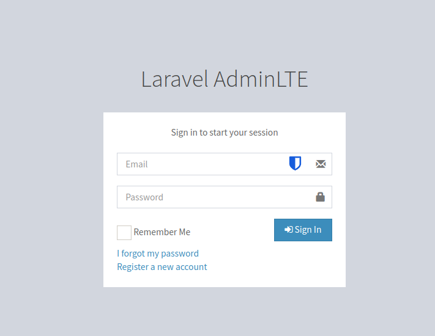
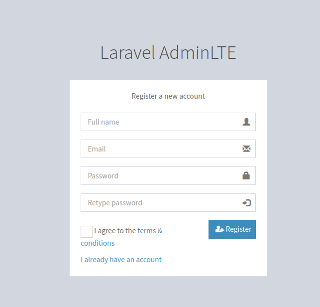
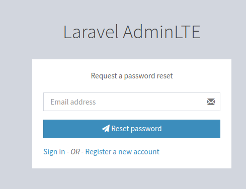

# Laravel AdminLTE Template

🚀 **Quickly set up your Laravel application with Docker!**

This starter template simplifies the process of building a Laravel application using Docker, allowing you to get up and
running without needing to install PHP locally.

## Features

- Pre-configured Laravel 11 application
- AdminLTE template preconfigured
- Authentication, Registration and Password reset functionality fully built in and configured.
- Easy configuration through a customizable `docker.env` file.
- Pre-defined scripts for building and connecting to your Docker containers.
- Seamless integration with [phpMyAdmin](https://www.phpmyadmin.net/) for database management.
- Seamless integration with [Mailhog](https://github.com/mailhog) for local mail development.

## Getting Started

1. Start by creating a new repository based on the *Laravel Docker Template* on *[GitHub](https://github.com)*.
2. Clone the new repository on your computer and open it in your favourite editor or IDE to get started.
3. Open the file `docker.env` and customize any of the environment variables to your needs. You may change the `DC_*`
   values in order to avoid container conflicts with already running containers.

    ```shell
    # Container name for the app service in docker-compose.yaml, must be unique for all containers running on your docker instance
    DC_APP_NAME="Laravel-AdminLTE"
    # Forwarded port for the Laravel app service
    DC_APP_PORT=5180
    # Forwarded port for phpMyAdmin service to view the underlying application database
    DC_PMA_PORT=5181
    # Forwarded port for Mailhog WebUI
    DC_MAILHOG_WEBUI_PORT=5125
    # MySQL credentials - username
    MYSQL_USER=app_development
    # MySQL credentials - password
    MYSQL_PASSWORD=password
    # MySQL credentials - database
    MYSQL_DATABASE=app_db
    ``` 

4. Once you have successfully configured your app via the `docker.env` file, run the `./dkbuild.sh` file to build your
   container images and run the application.
5. Next, run `./dkconnect.sh` to connect to the `app` service container where the *Laravel* application is running.
6. Run `composer install` to install the application and it's dependencies.

## Where to Next?

Congratulations on getting to this point. When you run `./dkconnect.sh` you will be shown the two URLs that you may use
to access the application and the database (via phpMyAdmin).

Inside the container, you may run any `php` or `artisan` command as you build your application. Any
changes you make in this container are immediately visible in your IDE and vice versa.

Happy coding! 🎉

## Screenshots








